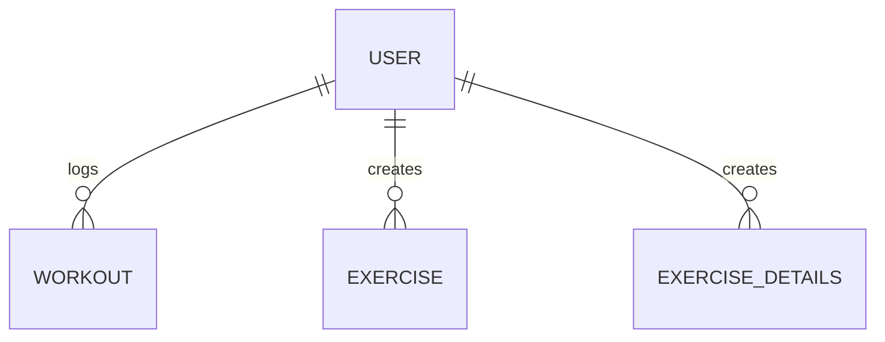
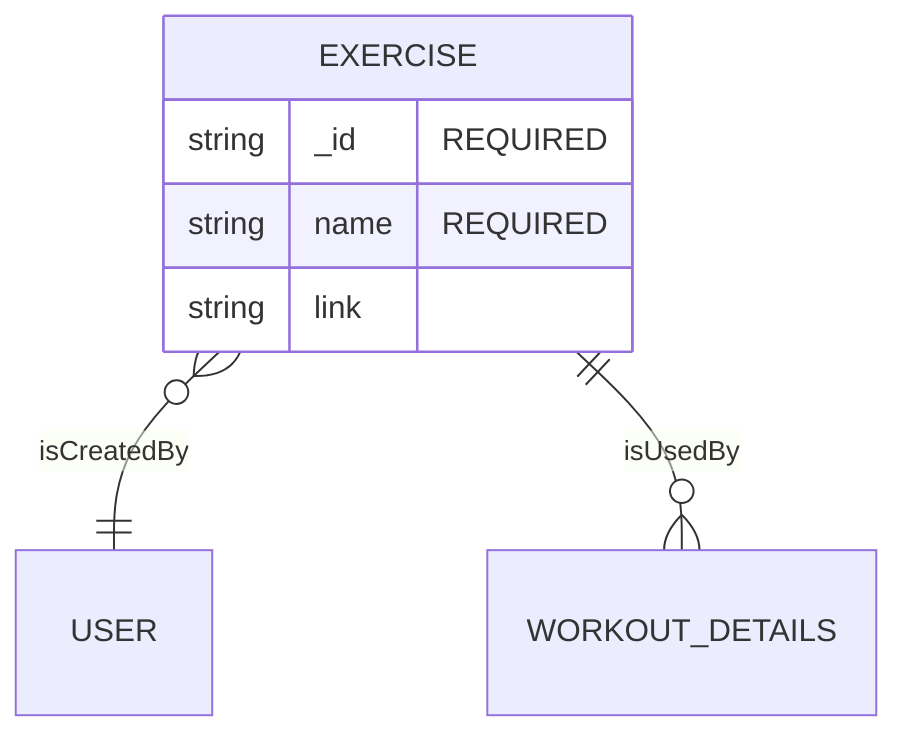
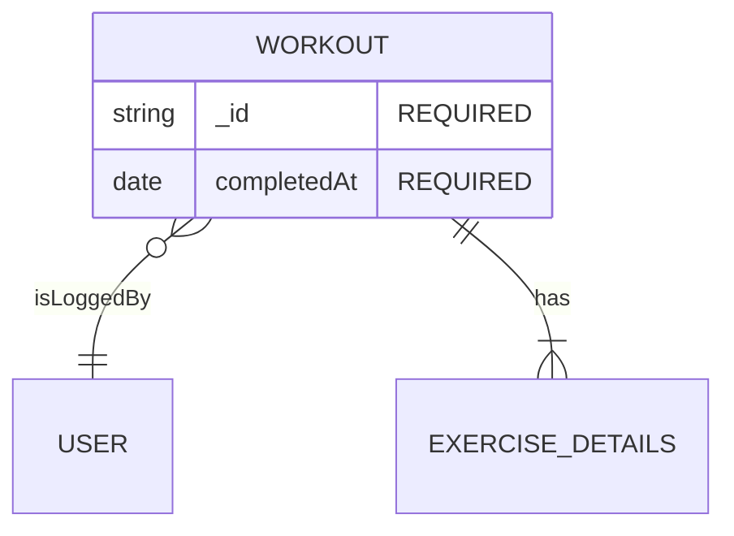
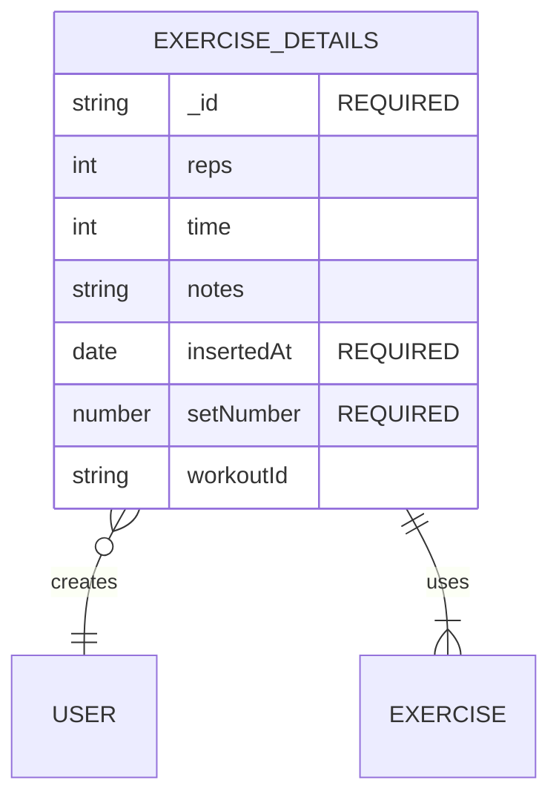

# MoveMF

## - one way to log your workouts without much clutter -

### The `live` environment is available over at [movemf.vercel.app](https://movemf.vercel.app 'MoveMF - Get a move on!').

### Y u build dis?

As part of my skill development plan I had the task of creating a working app using React and MongoDB (with some other bits in between to make life a bit easier).
In order for this demo app to become a reality and its implementations not complete chaos, I forged this document to have a relatively clear path of what I’m about to build. Over time I got proved that the path was not entirely clear. Documenting and breaking the whole cake in to bite-sized chunks however prevented chaos from ensuing though (BREAK BIG WORK ITEMS INTO SMALLER CHUNKS PEOPLE!).

The requirements my mentor gave me were the following: `Create an app what has a CRUD and uses MongoDB's views, query search, and auth.`

In other words I had complete creative freedom to make something that will push me into uncomfortable software development corners. All this pushing around would make me a better developer.
After giving it some though I drafted a document that outlined what my app was supposed to do, what problem it solved, and the tools it will use:

---

### What are you building?

I’m building a responsive minimalist workout tracker web app that makes data available through a user account.

---

### What problem are you solving?

Current workout apps are either too simple and lack a decent UX / basic features or they are highly convoluted with mountains of content that makes the app a burden to use. The minimalist workout tracker app strives to make tracking your workout easier and enjoyable without getting in the way.

---

### Tools used

- Hosting: Vercel
- Database: MongoDB
- API: Next.js
- Authentication: Next Auth + MongoDB
- UI: Next.js + React + Radix

---

### Views

- ✅ Workouts overview
- ✅ Create workout
- 🟥 Edit Workout
- ✅ Exercises overview
- ✅ Create Exercise Modal
- ✅ Edit Exercise Modal

---

### Functionality summary

- 🟥 The user is able to login / logout from the app
- ✅ The user can log a new workout
- ✅ The user can view a history of his workouts
- ✅ The user can view a list of added exercises
- ✅ The user can add previously added exercises to the workout
- 🟥 The user can duplicate a past completed workout
- 🟥 The user can search his list of exercises

---

### Data model

#### USER

#### EXERCISSE

#### WORKOUT

#### EXERCISE_DETAILS

---
